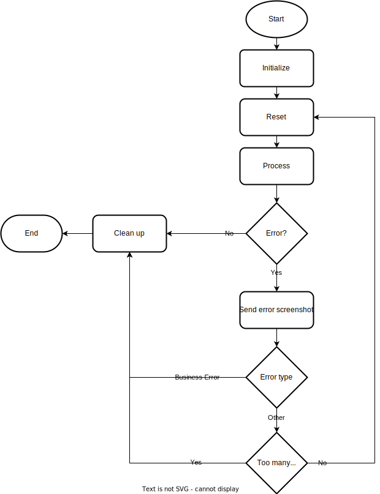
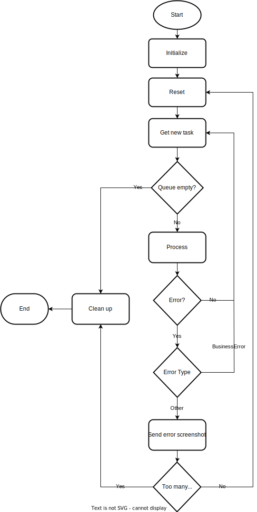

## Overview
This script retrieves document counts for specific caseworkers from the KMD Nova API and uploads the results to SharePoint. It uses authentication via OpenOrchestrator, processes two caseworkers, generates Excel reports, and stores them in a SharePoint folder.

## Prerequisites
- Python 3.x
- Required Python packages:
  ```sh
  pip install office365-rest-python-client requests pandas openpyxl
  ```
- Access to OpenOrchestrator with appropriate credentials
- SharePoint access for uploading files

## Configuration
### Environment Variables
Ensure the following environment variables are set:
- `OpenOrchestratorSQL` – Database connection string for OpenOrchestrator
- `OpenOrchestratorKey` – API key for OpenOrchestrator

### OpenOrchestrator Credentials
The script retrieves credentials from OpenOrchestrator:
- **Robot365User**: Used for SharePoint authentication.
- **KMDAccessToken & KMDClientSecret**: Used for Nova API authentication.

## Workflow
1. **Authenticate** with OpenOrchestrator and retrieve credentials.
2. **Establish a SharePoint connection** using `office365-rest-python-client`.
3. **Authenticate** with the Nova API to obtain an access token.
4. **Loop through caseworkers**, fetching document data from Nova API.
5. **Generate an Excel file** for each caseworker containing:
   - `Indsendelser`: Document category.
   - `Antal`: Number of documents found.
6. **Upload the Excel files** to the specified SharePoint folder.
7. **Delete the local Excel files** after upload.

## SharePoint Upload
The Excel files are uploaded to the SharePoint folder:
```
Delte dokumenter/Dokumentsøgning
```

## Expected Output
- Excel files named `{caseWorker}.xlsx` are created and uploaded.
- Logs in OpenOrchestrator confirm execution status.

## Error Handling
- The script raises an exception if API authentication or requests fail.
- Invalid responses or connection issues result in error messages being logged.

## Modifications
- Adjust the `caseworkers` list to include additional caseworkers.
- Modify `sharepoint_folder` to change the upload location.
- Update logging to suit your debugging needs.


# Robot-Framework V3

This repo is meant to be used as a template for robots made for [OpenOrchestrator](https://github.com/itk-dev-rpa/OpenOrchestrator).

## Quick start

1. To use this template simply use this repo as a template (see [Creating a repository from a template](https://docs.github.com/en/repositories/creating-and-managing-repositories/creating-a-repository-from-a-template)).
__Don't__ include all branches.

2. Go to `robot_framework/__main__.py` and choose between the linear framework or queue based framework.

3. Implement all functions in the files:
    * `robot_framework/initialize.py`
    * `robot_framework/reset.py`
    * `robot_framework/process.py`

4. Change `config.py` to your needs.

5. Fill out the dependencies in the `pyproject.toml` file with all packages needed by the robot.

6. Feel free to add more files as needed. Remember that any additional python files must
be located in the folder `robot_framework` or a subfolder of it.

When the robot is run from OpenOrchestrator the `main.py` file is run which results
in the following:
1. The working directory is changed to where `main.py` is located.
2. A virtual environment is automatically setup with the required packages.
3. The framework is called passing on all arguments needed by [OpenOrchestrator](https://github.com/itk-dev-rpa/OpenOrchestrator).

## Requirements
Minimum python version 3.10

## Flow

This framework contains two different flows: A linear and a queue based.
You should only ever use one at a time. You choose which one by going into `robot_framework/__main__.py`
and uncommenting the framework you want. They are both disabled by default and an error will be
raised to remind you if you don't choose.

### Linear Flow

The linear framework is used when a robot is just going from A to Z without fetching jobs from an
OpenOrchestrator queue.
The flow of the linear framework is sketched up in the following illustration:



### Queue Flow

The queue framework is used when the robot is doing multiple bite-sized tasks defined in an
OpenOrchestrator queue.
The flow of the queue framework is sketched up in the following illustration:



## Linting and Github Actions

This template is also setup with flake8 and pylint linting in Github Actions.
This workflow will trigger whenever you push your code to Github.
The workflow is defined under `.github/workflows/Linting.yml`.

